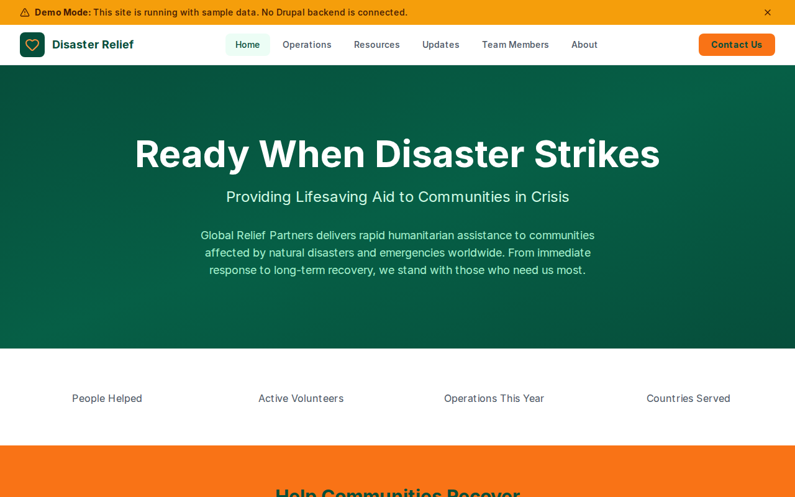

# Decoupled Disaster Relief

A disaster relief organization website starter template for Decoupled Drupal + Next.js. Built for humanitarian nonprofits, emergency response agencies, and disaster preparedness organizations.



## Features

- **Relief Operations** - Track active and past disaster response efforts with status, location, and impact metrics
- **Situation Updates** - Publish field reports with urgency levels and operational details
- **Preparedness Resources** - Share guides, toolkits, and training materials for communities and volunteers
- **Team Profiles** - Showcase organizational leadership and key staff across departments
- **Modern Design** - Clean, accessible UI optimized for humanitarian and emergency content

## Quick Start

### 1. Clone the template

```bash
npx degit nextagencyio/decoupled-disaster-relief my-relief-org
cd my-relief-org
npm install
```

### 2. Run interactive setup

```bash
npm run setup
```

This interactive script will:
- Authenticate with Decoupled.io (opens browser)
- Create a new Drupal space
- Wait for provisioning (~90 seconds)
- Configure your `.env.local` file
- Import sample content

### 3. Start development

```bash
npm run dev
```

Visit [http://localhost:3000](http://localhost:3000)

---

## Manual Setup

<details>
<summary>Click to expand manual setup steps</summary>

### Authenticate with Decoupled.io

```bash
npx decoupled-cli@latest auth login
```

### Create a Drupal space

```bash
npx decoupled-cli@latest spaces create "My Relief Organization"
```

Note the space ID returned. Wait ~90 seconds for provisioning.

### Configure environment

```bash
npx decoupled-cli@latest spaces env 1234 --write .env.local
```

### Import content

```bash
npm run setup-content
```

This imports:
- Homepage with hero section and organization statistics
- 3 relief operations (Hurricane Maria Gulf Coast, Earthquake Central Turkey, Midwest Flooding 2026)
- 3 situation updates with urgency levels
- 3 preparedness resources (Family Emergency Plan, Community Resilience Toolkit, Volunteer Training Manual)
- 3 team members (Carla Richardson, Ahmed Khalil, Jennifer Park)
- About page and Donate page
- Disaster types (Hurricane, Earthquake, Flood, Wildfire, Tornado, Drought)
- Resource types (Preparedness Guide, Recovery Toolkit, Training Manual, Safety Checklist, Community Guide)
- Team departments (Executive Leadership, Field Operations, Logistics, Communications, Volunteer Services)

</details>

## Content Types

### Relief Operation
- **disaster_type**: Type of disaster (Hurricane, Earthquake, Flood, etc.)
- **operation_status**: Current status of the operation
- **location**: Geographic area of the response
- **start_date**: When the operation began
- **people_served**: Number of people assisted
- **image**: Photo from the operation

### Situation Update
- **operation_name**: Related operation name
- **update_date**: Date of the field report
- **urgency_level**: Priority level (Critical, High, etc.)
- **image**: Photo accompanying the update

### Resource
- **resource_type**: Category of resource (Preparedness Guide, Training Manual, etc.)
- **audience**: Target audience for the resource
- **download_url**: Link to download the resource
- **image**: Resource cover or illustration

### Team Member
- **position**: Role within the organization
- **department**: Organizational department
- **email**: Contact email
- **phone**: Contact phone number
- **photo**: Staff portrait

## Customization

### Colors & Branding
Edit `tailwind.config.js` to customize colors, fonts, and spacing.

### Content Structure
Modify `data/disaster-relief-content.json` to add or change content types and sample content.

### Components
React components are in `app/components/`. Update them to match your design needs.

## Demo Mode

Demo mode allows you to showcase the application without connecting to a Drupal backend.

### Enable Demo Mode

```bash
NEXT_PUBLIC_DEMO_MODE=true
```

### Removing Demo Mode

1. Delete `lib/demo-mode.ts`
2. Delete `data/mock/` directory
3. Delete `app/components/DemoModeBanner.tsx`
4. Remove `DemoModeBanner` from `app/layout.tsx`
5. Remove demo mode checks from `app/api/graphql/route.ts`

## Deployment

### Vercel (Recommended)
[](https://vercel.com/new/clone?repository-url=https://github.com/nextagencyio/decoupled-disaster-relief)

### Other Platforms
Works with any Node.js hosting platform that supports Next.js.

## Documentation

- [Decoupled.io Docs](https://www.decoupled.io/docs)
- [Next.js Documentation](https://nextjs.org/docs)
- [Drupal GraphQL](https://www.decoupled.io/docs/graphql)

## License

MIT
